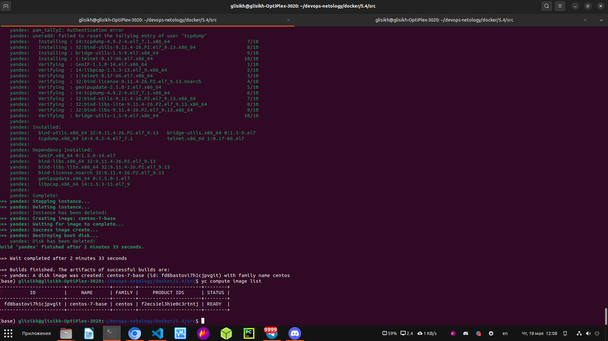
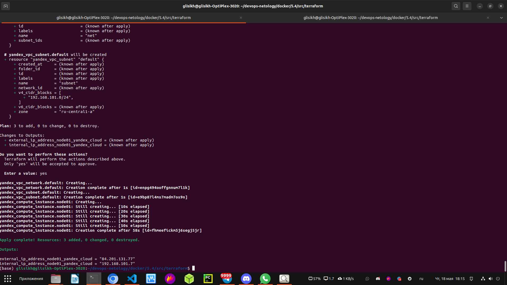
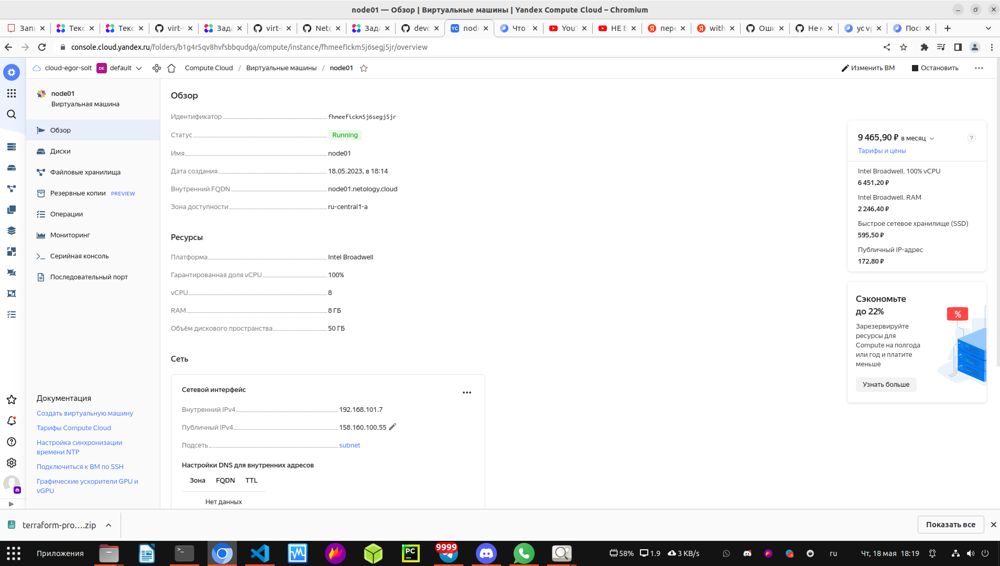
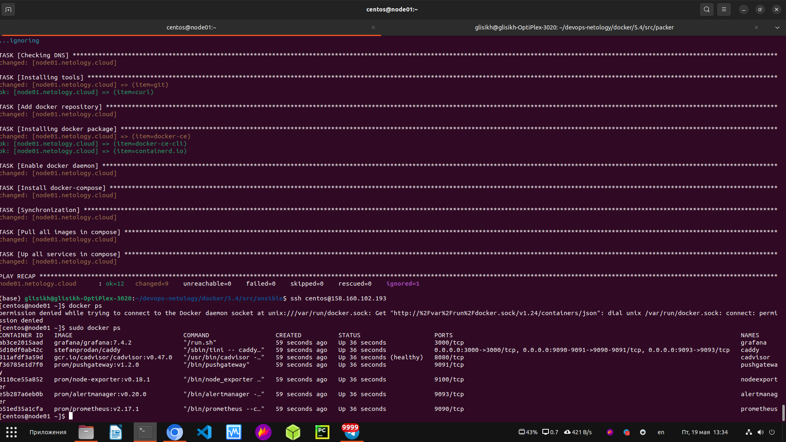
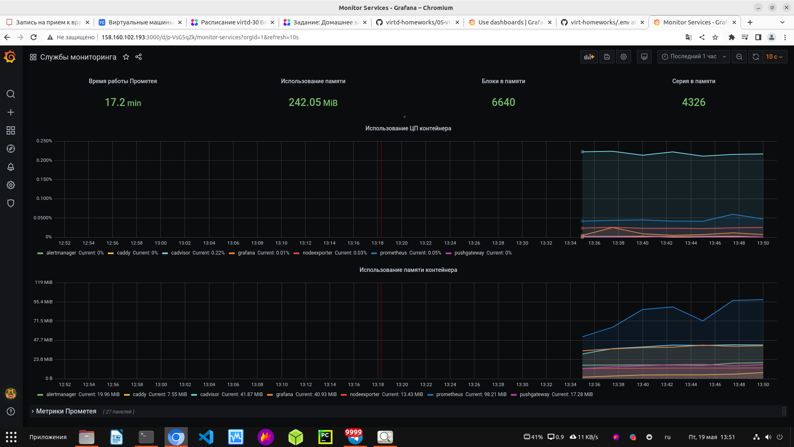
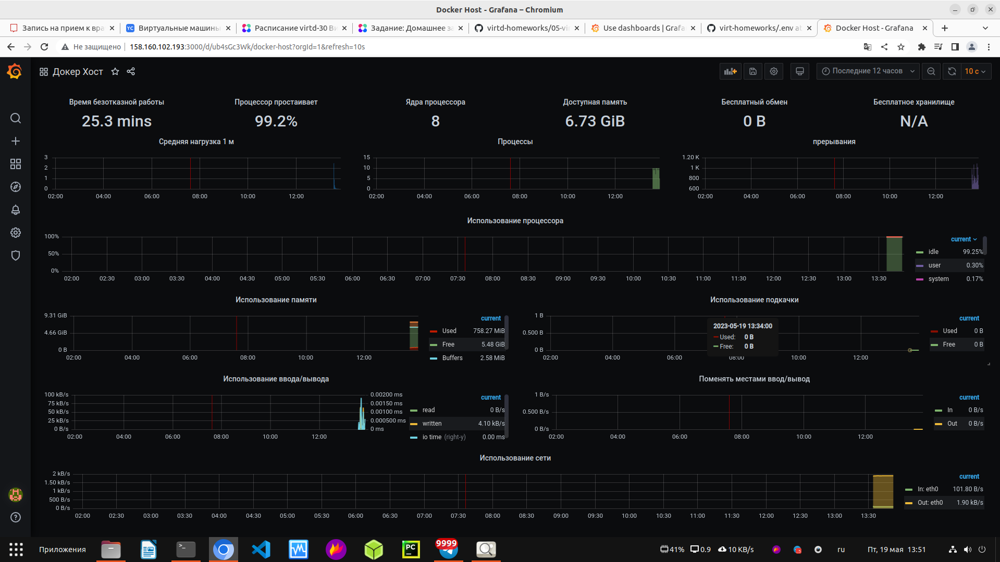
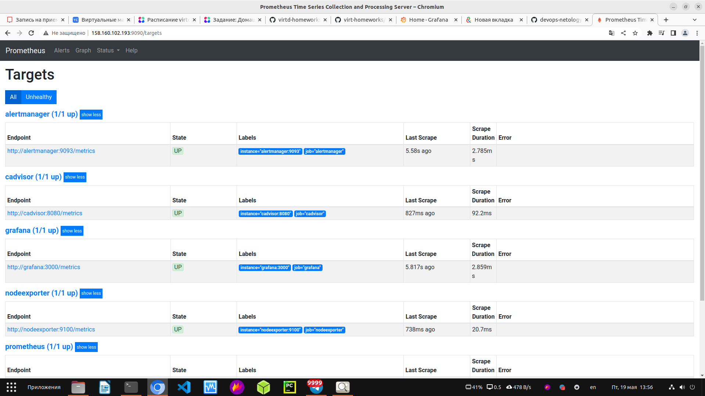

# Домашнее задание к занятию "5.4. Оркестрация группой Docker контейнеров на примере Docker Compose"

---

## Задача 1

Создать собственный образ операционной системы с помощью Packer.

Скриншот подтверждения создания образа с помощью Packer:

  

## Задача 2

Создать вашу первую виртуальную машину в Яндекс.Облаке.

2.2.* (Необязательное задание)
Создайте вашу первую виртуальную машину в YandexCloud с помощью Terraform (вместо использования веб-интерфейса YandexCloud). Используйте Terraform-код в директории (src/terraform).

Чтобы получить зачёт, вам нужно предоставить вывод команды terraform apply и страницы свойств, созданной ВМ из личного кабинета YandexCloud.

Скриншоты:

  

  

## Задача 3

С помощью Ansible и Docker Compose разверните на виртуальной машине из предыдущего задания систему мониторинга на основе Prometheus/Grafana. Используйте Ansible-код в директории (src/ansible).

Чтобы получить зачёт, вам нужно предоставить вывод команды "docker ps" , все контейнеры, описанные в docker-compose, должны быть в статусе "Up".

Скриншот:

  

## Задача 4

Задача 4
Откройте веб-браузер, зайдите на страницу http://<внешний_ip_адрес_вашей_ВМ>:3000.
Используйте для авторизации логин и пароль из .env-file.
Изучите доступный интерфейс, найдите в интерфейсе автоматически созданные docker-compose-панели с графиками(dashboards).
Подождите 5-10 минут, чтобы система мониторинга успела накопить данные.
Чтобы получить зачёт, предоставьте:

скриншот работающего веб-интерфейса Grafana с текущими метриками.

Скриншоты:

  

  

  

